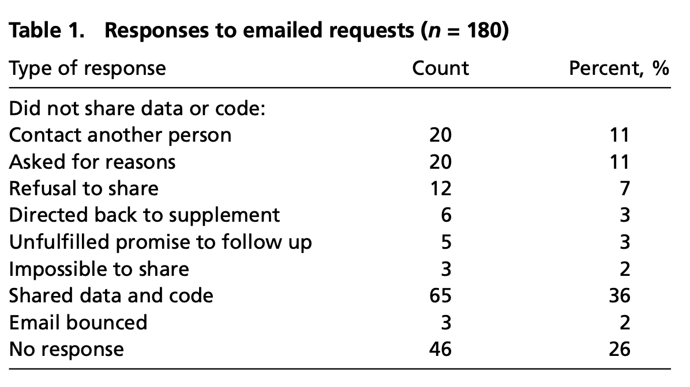

layout: true
<div class="my-footer"><span>bit.ly/njt-data-uw • @nj_tierney</span></div> 

```{r setup, include=FALSE}
# options(htmltools.dir.version = FALSE, width = 120)
# NOTE TO SELF: The CSS styles were created in `create-njt-theme.R`
knitr::opts_chunk$set(
  fig.path = "figures/",
  cache.path = "cache/",
  fig.align = "center",
  fig.width = 13,
  fig.height = 6,
  fig.retina = 3,
  fig.show = "hold",
  external = TRUE,
  # dev = "svglite",
  # dev.args = list(bg = "transparent"),
  message = FALSE,
  warning = FALSE,
  cache = FALSE,
  echo = FALSE,
  autodep = TRUE
)
```

```{r library, include = FALSE}
library(tidyverse)
library(gridExtra)
library(tibble)
library(visdat)
library(naniar)
library(gganimate)
library(knitr)
library(ggrepel)
```


```{r helpers, include=FALSE}
fig.fullsize <- c(fig.height = 3.5, 
                  fig.width = 8, 
                  out.width = "150%")

as_table <- function(...) knitr::kable(..., format='html', digits = 3)

theme_set(
  theme_grey(base_size = 16) +
  theme(
    legend.position = "bottom",
    plot.background = element_rect(fill = "transparent"),
    legend.background = element_rect(fill = "transparent")
  )
)

# **ni**ck's **pa**lette
nipa <- list(red = "#c03018",
             orange = "#f0a800",
             green = "#609048",
             purple = "#484878",
             light_purple = "#A3A3BB",
             light_green = "#AFC7A3",
             light_orange = "#F7D37F",
             light_red = "#DF978B",
             pale_purple = "#ECECF1",
             pale_green = "#D7E3D1",
             pale_orange = "#FBE9BF",
             pale_red = "#EFCBC4")

```

---

.large[
> "Data! data! data!" he cried impatiently. "I can't make bricks without clay." 

> --Sherlock Holmes (The Adventure of the Copper Beeches by Sir Arthur Conan Doyle)
] 


---
class: inverse, middle, center

.large[
This talk represents work that is currently in progress with Karthik Ram: 

**"A Realistic Guide to Making Data Available Alongside Code to Improve Reproducibility"**

_Feedback, discussion, questions encouraged throughout talk!_
]

---
class: inverse, middle, center

.vlarge[We need data]

--

.large[We need it to do our job]

--

.large[(though not strictly true for theory, but you get what I mean)]

---

# Benefits of Sharing data

.large[
`r emo::ji("magnifying")`  Makes work transparent 

`r emo::ji("check")` Increases trust 

`r emo::ji("speaker")` Increases visibility

`r icon::fontawesome("microscope")` Independent validation

`r emo::ji("recycle")` Reproducibility 
]


---
class: middle, invert, center

# Research isn't often shared

It's often really available to the authors


---

# Why not share data?

.large[
There are indeed good reasons to not share data:

1. Privacy concerns (e.g., human subjects, locations of critically endangered species)

1. May put the authors at a competitive disadvantage ( but data can be embargoed for reasonable periods of time)
]

---

# Why not share data?

.large[
"If you can't do something right, don't do it"

- This ^^ is wrong - you **can** provide something, even if it is just simulated data.

- Sharing data (in most cases) has a net positive benefit
]


---

# Rowhani-Farid & Barnett, 2016

.large[
Out of 160 randomly sampled BMJ papers:

- 3 included data in the paper
- 7/157 research articles shared their data sets
- For 21 clinical trials bound by the BMJ data sharing policy, 24% shared data
]
---

# Stodden, Seiler and Ma, 2018

.large[
_Science_ (the journal) made clause for Authors to provide data with papers

Authors evaluated reproducibility of 204 papers after clause issued.
]

---

# Responses to Stodden, Seiler and Ma, 2018

```{r stodden-table, out.width = "80%"}

```

---

# Responses to Stodden, Seiler and Ma, 2018


.large[
`r emo::ji("sad")`

> When you approach a PI for the source codes and raw data, you better
explain who you are, whom you work for, why you need the data and
what you are going to do with it.
]

---

# Responses to Stodden, Seiler and Ma, 2018

.large[
`r emo::ji("sad")`

> I have to say that this is a very unusual request without any explanation! Please ask your supervisor to send me an email with a detailed,
and I mean detailed, explanation.
]

---

# Responses to Stodden, Seiler and Ma, 2018

.large[

`r emo::ji("sad")`

> We do not typically share our internal data or code with people outside our collaboration.

]

---

# Responses to Stodden, Seiler and Ma, 2018

.large[

`r emo::ji("sad")`

> The code we wrote is the accumulated product of years of effort
by [redacted] and myself. Also, the data we processed was collected
painstakingly over a long period by collaborators, and so we will need
to ask permission from them too.
]

---

# Responses to Stodden, Seiler and Ma, 2018

.large[
`r emo::ji("sad")`

> Normally we do not provide this kind of information to people we do
not know. It might be that you want to check the data analysis, and
that might be of some use to us, but only if you publish your findings
while properly referring to us.

]

---

# Responses to Stodden, Seiler and Ma, 2018

.large[
`r emo::ji("sad")`

> Thank you for your interest in our paper. For the [redacted] calculations I used my own code, and there is no public version of this code,
which could be downloaded. Since this code is not very user-friendly
and is under constant development I prefer not to share this code

]

---

# Responses to Stodden, Seiler and Ma, 2018

.large[
`r emo::ji("tada")`

> Our program [redacted] is available here [URL redacted] (documentation and tutorials were included)
]


---

# Responses to Stodden, Seiler and Ma, 2018

.medium[
`r emo::ji("tada")`

> If you go to [URL redacted], under the publications, I have a link
to the gitHub repository. I don’t know if I have all of the raw simulated data, but I certainly have the processed data used to make the
plots. What do you need? All of the simulated data could of course
be regenerated from the code.
]

---

# Responses to Stodden, Seiler and Ma, 2018

.large[
`r emo::ji("tada")`
> Please find attached a .zip file called [redacted].zip that has the custom MATLAB [redacted] analysis code. If you run Masterrunfigureone.m this will generate several panels from the paper.
]

---

# Responses to Stodden, Seiler and Ma, 2018

.large[
`r emo::ji("tada")`
> In the next email I will enclose the custom image analysis software.
This can also be accessed from [URL redacted] where there is a manual and tutorial.
] 

---

# Sharing data?

.large[
Plenty of research says it is important
]

--

.large[
Fata sharing should be FAIR (findable, Accessible, Interoperable, and Reusable)
]

--

.large[
But, unfortunately, these don't precicely tell you how to share data
]

---

# Some more barriers to sharing data

.large.pull-left[

Socio-Culture Barriers:

- Misaligned Incentives
- Cultural Norms
- Genomics vs Clinical Trials
- Scooping

]

--

.large.pull-right[

Technological Barriers:

- Where to start?
- Google Drive?
- Dropbox?
- FTP?

]

---

# Another way to think about sharing data

.pull-left[

```{r show-rock, out.width = "100%"}

```

]

--

.pull-right[

```{r show-ramp, out.width = "100%"}

```

]

???

It should instead be an "on-ramp"

It can feel like a wall or a mountain we need to climb. 

These require special tools and knowledge.


---

# An on ramp to sharing data

.medium[
1. Analysis ready data: Final data used in analysis
1. README: A Human readable description of the data
1. Data dictionary: Human readable dictionary of data
1. Raw data: The original/first data provided
1. Scripts: To clean raw data ready for analysis
1. License: How to use and share the data
1. Citation: How you want your data to be cited
1. Machine readable meta data: Make your data searchable
]
---

# Analysis ready data: Final data used in analysis

.left-code[
```
project 
└── data
    └── crime.csv
```
]

--

.right-plot.medium[
- Dataset(s) in the form used in analysis.
- Ideally in "tidy data" form.
- Plain-text format, `.csv`, `.tsv`, `.txt`
- Binary formats discouraged
- e.g., `.rda`, `.rds`, `.sav`, `.dta`
]

---

# README: A Human readable description of the data

.left-code[
```
project 
├── data
|   └── crime.csv
└── README.md
```
]

.right-plot[
- Top level of the data repository, (optionally for each dataset)
- Who, what, when, where, why
- Guides how to understand directory.
- Handy when no reliable standards
- `.md` = take advantage of `markdown`
]


---


# Data dictionary: Human readable dictionary of data contents

.left-code[
```
project 
├── data
│   ├── crime.csv
│   └── crime-dictionary.csv 
└── README.md
```
]

.right-plot[
- Human readable description, context, and structure of the data
- Helps familiarise user with data
- It should contain:
  - **variable names**
  - **variable labels**
  - **variable codes**, and
  - special values for **missing data**
]

---

# Data Dictionary: Human readable dictionary of data contents

```{r print-table, echo = FALSE}

dat <- tribble(
  ~job_position, ~outside, ~statistics, ~date_started,
   "Lecturer",        1,        1,      "2019-01-01",
   "Professor",       0,        0,      NA,
   "Senior Lecturer", 1,        1,      "unknown"
)

variable_labels <- tribble(
  ~variable, ~description,
  "job_position", "University Job Position",
  "outside",      "Did this person study outside this university?",
  "statistics",   "Is this perosn in the statistics faculty",
  "date_started", "What date did this perosn start their position?"
)

variable_codes <- tribble(
  ~variable,        ~code,
   "job_position",   "text description of job position",
   "outside",       "0 = not studied outside, \n1 = has studied outside",
   "statistics",    "0 = is not in statistics dept., \n1 = is currently in statistics dept.",
   "date_started",   "date variable in format YYYY-MM-DD, \ne.g., 2001-01-01 is 1st January, 2001"
)

variable_info <- left_join(variable_labels, 
                           variable_codes,
                           by = "variable")

missing_values <- tribble(
  ~value, ~meaning,
  NA,     "Missing value",
  "unknown", "Missing value"
)

grid.arrange(
  tableGrob(dat),
  tableGrob(variable_info),
  tableGrob(missing_values),
  ncol = 1
)

```

---

# Raw data: The original/first data provided

.left-code[
```
project 
├── data
│   ├── crime.csv
│   └── crime-dictionary.csv 
├── data-raw
│   └── crime-raw.dat
└── README.md
```
]

.right-plot[
- usually **first format** of data provided before tidying or cleaning. 
- **If the raw data is a practical size to share**, share in folder `data-raw`. 
- Ideally: in form first received, even if binary / proprietary format.  
- (Optionion) include data dictionaries of raw data in `data-raw`.
]

---

# Scripts: To clean raw data

.left-code[
```
project 
├── data
│   ├── crime.csv
│   └── crime-dictionary.csv 
├── data-raw
│   ├── crime-raw.dat
│   ├── clean-crime.R
│   └── other-steps.md
└── README.md
```
]

.right-plot[

- Code used to clean and tidy the raw data. 
- `clean-crime.R`
- Ideally involves only scripted languages
- If other practical steps were taken to clean up the data, these should be recorded in a plain text or markdown file.
- `other-steps.md`

]

---

# License: How to use and share the data

.left-code[
```
project 
├── data
│   ├── crime.csv
│   └── crime-dictionary.csv 
├── data-raw
│   ├── crime-raw.dat
│   ├── clean-crime.R
│   └── other-steps.md
├── README.md
└── LICENSE
```
]

.right-plot[

- Data + license clearly establishes how everyone to modify, use, and share data. 
- Two licenses well suited for data sharing:

1. CCBY: enforce attribution and credit required, no warranty.
2. CC0: public domain. No ownership or warranty

- Provide LICENSE file with entire license in the top level of directory.
- `use_cc0_license()`
- `use_ccby_license()`
]


---

# Citation: How to cite your data

.left-code[
```
project 
├── data
│   ├── crime.csv
│   └── crime-dictionary.csv 
├── data-raw
│   ├── crime-raw.dat
│   ├── clean-crime.R
│   └── other-steps.md
├── README.md (reference DOI)
├── CITATION
└── LICENSE
```
]

.right-plot[

- A Digital Object Identifier (DOI) uniquely + permanently identifies a digital object ( paper, poster, or software)
- DOIs are minted by repositories like Dryad or Zenodo for free.
- Put the DOI in a reference format like BibTex (zenodo does this for you)
]

---

# Citation: example

```
@software{housing-data,
  author       = {Tony Pino, Nicholas Tierney},
  title        = {njtierney/melb-housing-data: Added LICENSE.md file},
  month        = feb,
  year         = 2019,
  publisher    = {Zenodo},
  version      = {1.0.1},
  doi          = {10.5281/zenodo.2575545},
  url          = {https://doi.org/10.5281/zenodo.2575545}
}
```

---

# Machine readable meta data: Make your data searchable

.left-code[
```
project 
├── data
│   ├── crime.csv
│   ├── crime-dictionary.csv 
│   └── metadata
│       ├── access.csv
│       ├── attributes.csv
│       ├── biblio.csv
│       ├── creators.csv
│       └── dataspice.json
├── data-raw
│   ├── crime-raw.dat
│   ├── clean-crime.R
│   └── other-steps.md
├── README.md (reference DOI here)
├── CITATION
└── LICENSE
```
]

.right-plot[
- Metadata provided in "metadata" folder, for every dataset. 
- Helps ensure data types are preserved.
- Allows data to be indexed and searched with google datasets via JSON-LD.
- To create appropriate metadata, we recommend `dataspice` & `codebook`
]

---

.large[
[Example Machine readable meta data: housing data](https://github.com/njtierney/melb-housing-data)
]

```
library(dataspice)
create_spice(here::here("data"))
prep_attributes()
prep_access()
edit_access()
edit_attributes()
edit_biblio()
edit_creators()
write_spice()
```

---

# Actually sharing the data

.large[
Now that you've created your data folder, you need to **get it somewhere online**

Two options to discuss:

1. Putting the data online
1. Sharing as an R package
]

---
class: inverse, center, middle
# Online repositories: Zenodo & Dryad

---

# Zenodo

.large[
- Launched in 2013 in a joint collaboration between openAIRE and CERN
- Free, archival location to deposit datasets
- File size limit is 50gb for individual files
- Able to accommodate larger file sizes upon request
]

---

# Dryad

.large[
- The Dryad Digital Repository takes data from any field of research, and perform human quality control and assistance of the data
- Can link data with a journal publication, in exchange for a data publishing fee.
]

---

# Linking zenodo and GitHub

.large[

You can also link Zenodo with Github

Zenodo updates with new DOI at every "release" (Helps avoid managing many moving pieces)

See this article on github, [making your code citable](https://guides.github.com/activities/citable-code/) (Thanks to [Arfon Smith](https://www.arfon.org/))
]

---

# Sharing data as an R package

.large[
e.g., [`nycflights13`](https://github.com/hadley/nycflights13), [`eechidna`](https://docs.ropensci.org/eechidna/), [more](https://ropenscilabs.github.io/OZdatasets/)
  ]
  
.pull-left.large[
Pros

- installable
- documentation
- share data cleaning
- great for R users
]

.pull-right.large[

Cons

- Size: ! >= 5Mb (CRAN)
- Doesn't help others outside R
- No structured metadata
]

---

# Sharing data as an R package

.medium[
- Most (but not all!) data shared as an R package, or with an R package is for teaching purposes
]

--

.medium[
- Sharing data like this allows you to create a "research compendium", with centralised code + paper + computing environment + data.
]

--

.medium[
- See more about this in Karthik Ram's talk: ["How To Make Your Data Analysis Notebooks More Reproducible"](https://github.com/karthik/rstudio2019)
]

--

.medium[
- Note the directory structure based is on R packages
]

---

# Online "data" journals

.large[
- Provides familiar mechanism for citation
- But journals don't yet have a good way to outline how to share data
- Often looks like a "mini paper" with the methods, and isn't always about the data, but about collection methods.
- Can link to a Zenodo or Dryad repository.
]

---

# Online "data" journals

.large[
Some example data journals:

- [Nature: Scientific Data](https://www.nature.com/sdata/)
- [Data in Brief](https://www.journals.elsevier.com/data-in-brief)
- [Data](https://www.mdpi.com/journal/data)
- [GigaScience](https://academic.oup.com/gigascience)

]

---

# Take homes

.large[
- You don't have to do every single thing to publish your data
- Take small steps - get the data somewhere first, add more detail as you go
]

---

# Future Directions

.large[
- Currently working on a proposal for "datadevtools" - a set of developer tools to facilitate sharing data
- These tools can then be used to assess "shareability" of data
]

---

# Discussion Questions

.large[
* Do you curate data?
* What are the common painpoints of curating data / collaborating on data?
* How do you manage data releases?
* What are the resistance points to data sharing? 
* Is data shared publicly, is there a process?
* How do you distribute data?
]

---

# Thanks

.large[
- Karthik Ram
- Miles McBain
- Anna Kystalli
- Daniella Lowenberg
- Kara woo
- ACEMS International Mobility Programme
- Helmsley Charitable Trust
- Gordon and Betty Moore Foundation
- Sloan Foundation
]


---

# References

.large[
- [making your code citable](https://guides.github.com/activities/citable-code/)
- [Stodden et al](https://www.pnas.org/content/115/11/2584)
- [Rowhani-Farid  & Barnett](https://bmjopen.bmj.com/content/6/10/e011784.abstract)
]

---

# Colophon

.large[
- Slides made using [xaringan](https://github.com/yihui/xaringan)
- Extended with [xaringanthemer](https://github.com/gadenbuie/xaringanthemer)
- Colours taken + modified from [lorikeet theme from ochRe](https://github.com/ropenscilabs/ochRe)
- Header font is **Josefin Sans**
- Body text font is **Montserrat**
- Code font is **Fira Mono**
- template available: [njtierney/njt-talks](github.com/njtierney/njt-talks)
]

---

# Learning more

.large[
`r icon::fontawesome("newspaper") ` [paper at github.com/karthik/ddd](https://github.com/karthik/ddd)

`r icon::fontawesome("link")` [bit.ly/njt-data-uw](https://njt-data-uw.netlify.com)

`r icon::fontawesome("twitter")` nj_tierney

`r icon::fontawesome("github")` njtierney

`r icon::fontawesome("plane")` nicholas.tierney@gmail.com

]


---

.vhuge[
**End.**


]
